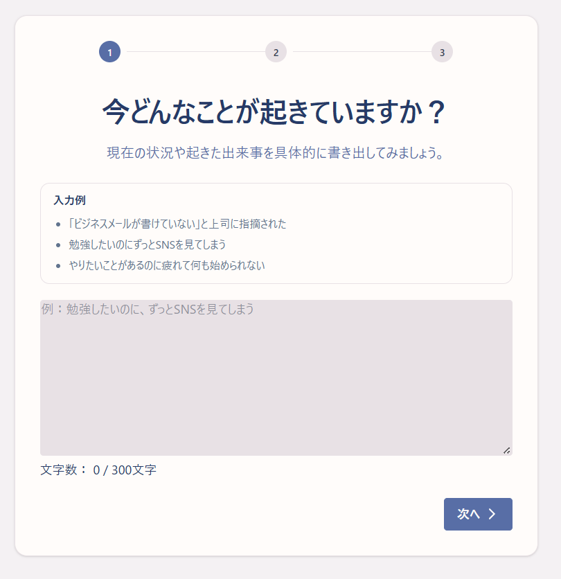
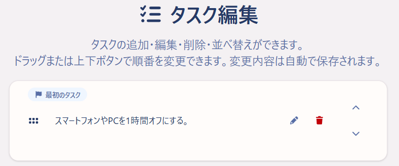
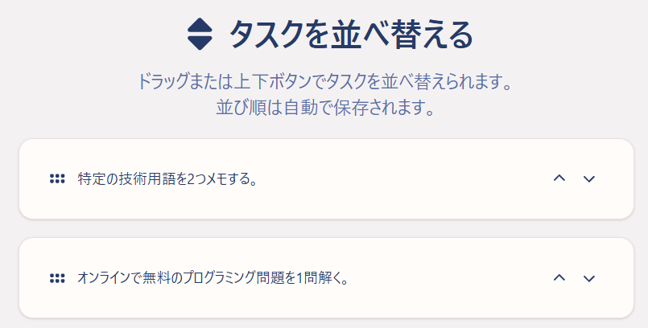
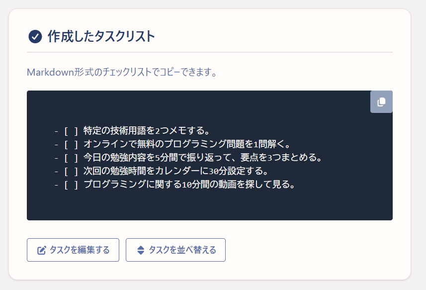

# ReNovo

<p align="center">
  
</p>

## 概要

ReNovoは、考えすぎて行動に移せない人のためのタスク分解サービスです。

現在の状況・問題・目標を入力すると、AIが5〜15分程度で取り組める5つの具体的なタスクに分解します。

## URL

[https://renovoapp.net](https://renovoapp.net)

## 使い方

### 現在の状況を入力

「現在の状況」「解決したい問題」「達成したい目標」を3ステップで入力し、今の状況を整理します。



### AIが生成したタスクを編集

入力内容をもとに、AIが5つのタスクを提案します。生成後は、タスクの追加・編集・削除ができます。



### タスクを並べ替え

ドラッグまたは上下ボタンでタスクの順番を並べ替えます。



### コピーして行動

タスクをマークダウン形式でコピーできます。<br>
作成したタスクや入力した情報は履歴画面からいつでも確認できます。



## 技術スタック

| 分類           | 技術                  |
| -------------- | --------------------- |
| Backend        | Ruby 4.0.5            |
|                | Ruby on Rails 8.1.3.1 |
|                | PostgreSQL 14.19      |
| Frontend       | Hotwire               |
|                | Turbo                 |
|                | Stimulus              |
|                | Tailwind CSS 4.3.1    |
|                | SortableJS            |
| Infrastructure | Render                |
|                | GitHub Actions        |
| Testing / Lint | RSpec                 |
|                | RuboCop               |
|                | ESLint                |
|                | ERB Lint              |
| External API   | OpenAI API            |

## ローカル開発環境

### 前提条件

ローカル環境で起動するには、以下が必要です。

- Ruby 4.0.5
- PostgreSQL 14以上
- Node.js
- npm
- OpenAI APIキー
- Google OAuthのクライアントIDとクライアントシークレット

### 認証情報の設定

OpenAI APIとGoogle OAuthの認証情報は、Rails Credentialsで管理します。
以下のコマンドで、ローカル開発用のCredentialsを編集してください。

```bash
bin/rails credentials:edit --environment development
```

次の形式で認証情報を設定します。

```yaml
openai:
  api_key: your_openai_api_key

google:
  client_id: your_google_client_id
  client_secret: your_google_client_secret
```

Google Cloud Consoleでは、承認済みのリダイレクトURIに以下を登録してください。

```text
http://localhost:3000/auth/google_oauth2/callback
```

`config/master.key`やAPIキーなどの秘密情報は、Gitにコミットしないでください。

## インストールと起動

```bash
git clone https://github.com/koguchi-e/ReNovo.git
cd ReNovo
bin/setup
```

## Lint/Test

### Lintを実行する

```bash
bin/lint
```

### テストを実行する

```bash
bundle exec rspec
```
